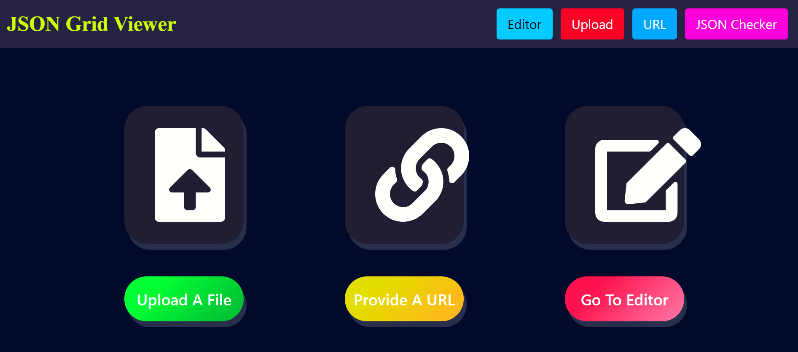
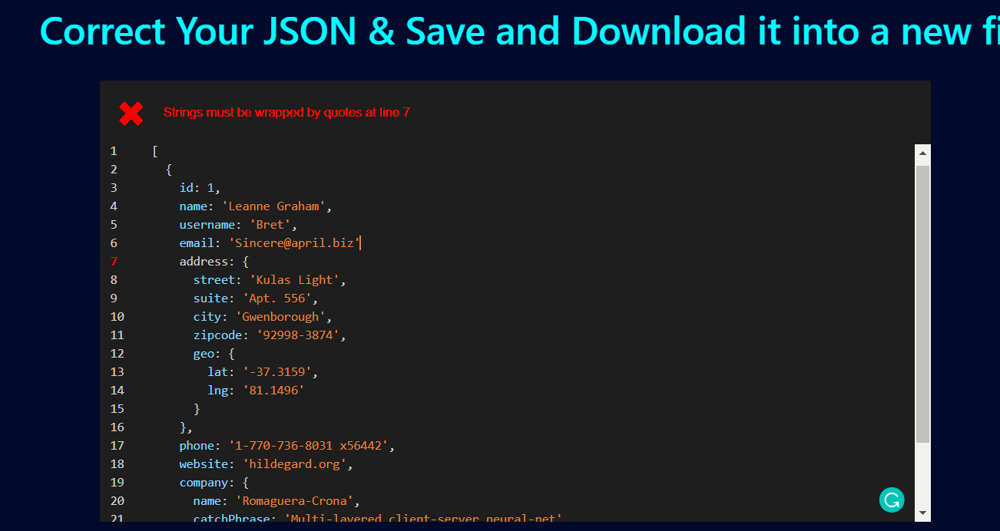
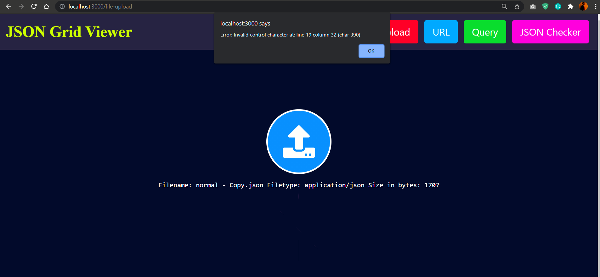
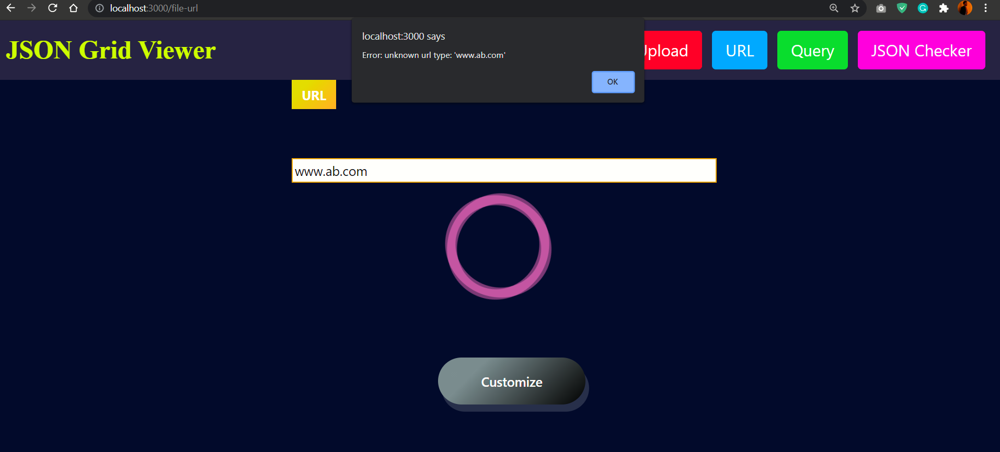
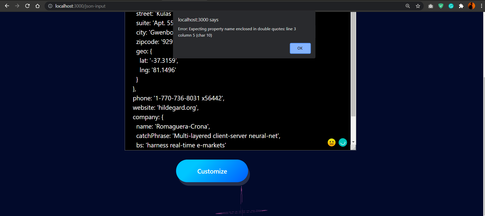
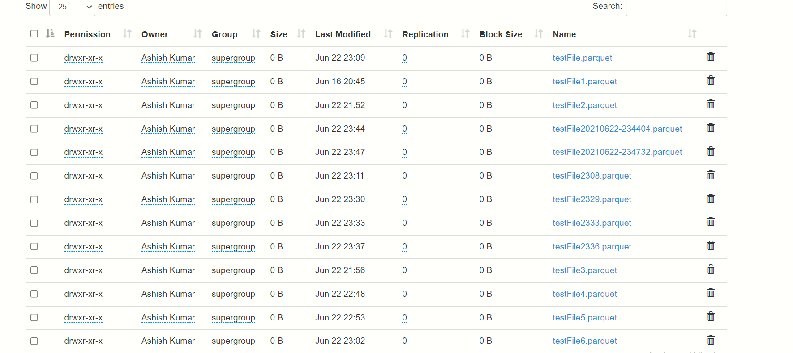
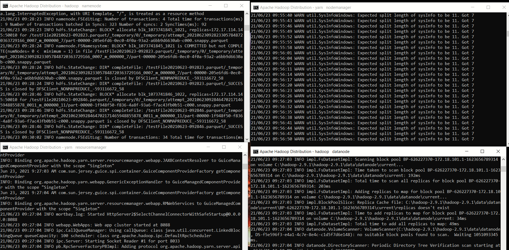

refs 
- pyinstaller https://pyinstaller.readthedocs.io/en/stable/operating-mode.html
- generating production https://medium.com/@johndyer24/building-a-production-electron-create-react-app-application-with-shared-code-using-electron-builder-c1f70f0e2649
- electron production https://medium.com/@kitze/%EF%B8%8F-from-react-to-an-electron-app-ready-for-production-a0468ecb1da3
- integrating backend with electron https://medium.com/red-buffer/integrating-python-flask-backend-with-electron-nodejs-frontend-8ac621d13f72
- shipping backend exe with electron https://medium.com/red-buffer/electron-builder-packaging-electron-nodejs-application-along-with-flask-app-for-windows-fc26f5a29870 
# Json-Grid-View

This project fetches the JSON in different ways and parses it into tabular form and saves it into HDFS.

	  
Requirements to run the project

	  > 1. node
	  > 2. python
	  > 3. java(Optional)
	  > 4. hadoop(Optional)

  	
Installation

	
  		Download Zip file and Extract it
	

	
Install Python Libraries

		 1. Open new cmd window

		 2. cd *path to extracted Json-Grid-View folder*

		 3. cd backend 

		 4. pip install -r requirements.txt

	

	
Install Node

		  Step 1: Download Node.js Installer
		    In a web browser, navigate to https://nodejs.org/en/download/ to download Node in your system.
		    Click the Windows Installer button to download the latest default version. 
			The Node.js installer includes the NPM package manager.

			Congratulations !! You have succesfully downloaded the Node  in the machine.

		  Step 2: Install Node.js and NPM from Browser
			  1. Once the installer finishes downloading, launch it. 
			     Open the downloads link in your browser and click the file. Or, browse to the location where you have saved the file and double-click on it to launch.

			  2. A pop up will be generated which will ask if you want to run the software – click Run.

			  3. You will be welcomed to the Node.js Setup Wizard.
			  	 Now – click Next.

			  4. On the next screen, review the license agreement. 
			  	Click Next for all and agree for all the the terms and install the software in the machine.

			  5. The installer will prompt you for the installation location. 
			  	Leave the default location, unless you have a specific need to install it somewhere else – then click Next.
				(In most cases the by default the installation location is in C drive. )

			  6. The wizard will let you select components to include or remove from the installation. 
			  	  Accepting the defaults is preferred.
			  	 Again, unless you have a specific need, accept the defaults by clicking Next.

			  7. Finally, click the Install button to run the installer. 
			  	When it finishes, click Finish.

				Congratulations !! You have succesfully installed the Node and npm in the machine.

		Step 3: Verify Installation
		  Open a command prompt (or PowerShell), and enter the following:
			
			To check the version of Node.
			node -v
			If node was succesfully installed , the system should display the Node.js version installed on your system.
			If it is not the case try following the steps again. 

			To check the version of npm.
			npm -v
			If node was succesfully installed , the system should the system should display the npm version installed on your system.
			If it is not the case try following the steps again. 

	
	

	  
Install Hadoop

		  Installing  Hadoop 2.9.1 on Windows 10 platform. 
		  (Here we are Setting up for Single Node Hadoop Cluster).

		  Step 1 : You can Download the hadoop version 2.9.1 from the link provided below:

		  Download Link: https://www.apache.org/dyn/closer.cgi/hadoop/common/hadoop-2.9.1/hadoop-2.9.1.tar.gz

		  Step 2 : Create a folder path as given below and copy the downloaded msi into this folder.
		  (User can also create folders with different name. Here we will follow ‘C:/Hadoop/hadoop-2.9.1’).

		  Path: ‘C:/Hadoop/hadoop-2.9.1’

		  Step 3: The user then needs to download the windows compatible binaries .
		  These files can be also downloaded from other sources just keep a check of the version of binary files.
		  The user can download these files from under given links.

		  Link: https://github.com/ParixitOdedara/Hadoop

		  Step 4: Extract the downloaded zip using 7-zip or any unzipping tool
		  and copy all the files present under bin folder to C:\Hadoop\hadoop-2.9.1\bin.
		  If conflict arises Replace the existing files as well.

		  Step 5: Go inside C:/Hadoop/hadoop-2.9.1 and create a folder with name ‘data’. 
		  Inside the ‘data’ folder create two other folders namely: ‘datanode’ and ‘namenode’.

		  Step 6: Now the user needs to set up the Environment Variables for the Machine.
		  To set up the Environment variables follow the following steps:
		  (i). Go to My computer 
		  (ii). Right Click
		  (iii). Properties
		  (iv). Advanced System settings
		  (v). Environment variables
		  (vi). Now Click New to create a new environment variables.

		  The Environment variables to be set:
		  For hadoop we need to set up HADOOP_HOME and HADOOP_BIN.

		  HADOOP_HOME=”C:\Hadoop\hadoop-2.9.1″
		  HADOOP_BIN=”C:\Hadoop\hadoop-2.9.1\bin”

		  Just to validate if the environment variable were succesfully set, open new cmd and try the following commands:
		  
		  -- echo %HADOOP_HOME%
		      This should return "C:\Hadoop\hadoop-2.9.1".
			  If it is not the try case try the above steps again.

		  -- echo %HADOOP_BIN%
		      This should return "C:\Hadoop\hadoop-2.9.1\bin".
			  If it is not the try case try the above steps again.

		  Now in order to configure the hadoop on Windows10 we have to edit below mention files in their respective loactions.
			  The files are:

		      1. hadoop-env.cmd
		      2. core-site.xml
		      3. hdfs-site.xml
		      4. mapred-site.xml

		  Step 7: Edit the hadoop-env.cmd 
		
		  File location:- C:\Hadoop\hadoop-2.9.1\etc\hadoop\hadoop-env.cmd

		  Need to add:-
		      set HADOOP_PREFIX=%HADOOP_HOME%
		      set HADOOP_CONF_DIR=%HADOOP_PREFIX%\etc\hadoop
		      set YARN_CONF_DIR=%HADOOP_CONF_DIR%
		      set PATH=%PATH%;%HADOOP_PREFIX%\bin

		  Step 8: Edit core-site.xml

		  File Location:- C:\Hadoop\hadoop-2.9.1\etc\hadoop\core-site.xml 

		  Need to add:-

		  ( content to written within <configuration> </configuration> tags.)
		   <configuration>
		     <property>
		       <name>fs.default.name</name>
		       <value>hdfs://0.0.0.0:19000</value>
		     </property>
		  </configuration>

		  Step 9: Edit hdfs-site.xml 

		  File Location:- C:\Hadoop\hadoop-2.9.1\etc\hadoop\hdfs-site.xml.

		  Need to add:- 

		      (below content within <configuration> </configuration> tags.)
		   <configuration>
		     <property>
			<name>dfs.replication</name>
			<value>1</value>
		     </property>
		     <property>
			<name>dfs.namenode.name.dir</name>
			<value>C:\Hadoop\hadoop-2.9.1\data\namenode</value>
		     </property>
		     <property>
			<name>dfs.datanode.data.dir</name>
			<value>C:\Hadoop\hadoop-2.9.1\data\datanode</value>
		     </property>
		  </configuration>

		  Step 10: Edit mapred-site.xml

		  File location:- C:\Hadoop\hadoop-2.9.1\etc\hadoop\mapred-site.xml.

		  Need to add:- 

		      (below content within <configuration> </configuration> tags. 
		      If you don’t see mapred-site.xml then open mapred-site.xml.template file and rename it to mapred-site.xml )

		   <configuration>
		     <property>
			<name>mapreduce.job.user.name</name>
			<value>%USERNAME%</value>
		     </property>
		     <property>
			<name>mapreduce.framework.name</name>
			<value>yarn</value>
		     </property>
		     <property>
			<name>yarn.apps.stagingDir</name>
			<value>/user/%USERNAME%/staging</value>
		     </property>
		     <property>
			<name>mapreduce.jobtracker.address</name>
			<value>local</value>
		     </property>
		  </configuration>

		  Step 11: Additional Configuration:- 

		  Check if:

		      C:\Hadoop\hadoop-2.9.1\etc\hadoop\slaves file is present, 
		      if that file not available create the file with name slave.txt and write localhost inside it.

		  Note:
		      One most common issue one can get is illegal character Exception.
		      This generally occurs when someone has a space in the name of their PC.
		      In this we need to open the hadoop-env.cmd file .
			  	
		      File location:- C:\Hadoop\hadoop-2.9.1\etc\hadoop\hadoop-env.cmd
			   Do the following changes.

		      set HADOOP_IDENT_STRING="The name of your PC without Spacebar"
			  This removes the extra character and resolves the issue.

		  Step 12: Node formatting

		  To format the node, open the cmd in administrative mode and execute the below command:

		      --hadoop namenode -format

		  Step 13: To start the hadoop open the CMD as Administrator and type below command. 

		      -- start-all.cmd

		      It will open 4 new windows cmd terminals for 4 daemon processes, namely :
		      --nodemanager
		      --resourcemanager
			  --namenode
		      --datanode

		  -- To access Resource Manager go to http://localhost:8088 from your web browser.

		  -- To access Node Manager go to http://localhost:8042 from your web browser.

		  -- To access Name Node go to  http://localhost:50070 from your web browser.

		  -- To access Data Node go to http://localhost:50075 from your web browser.

		  Reference :- https://hadoop.apache.org/

	
Install JAVA

		  Check whether Java is already installed on the system or not. 
		  Use the command javac in cmd.
		  If not installed it will show unknown command.

 		  Step 1: Download JDK

		    Click the below link to download jdk 1.8 for you windows 64 bit system.

			Download JDK Link For Windows : http://download.oracle.com/otn-pub/java/jdk/8u161-b12/2f38c3b165be4555a1fa6e98c45e0808/jdk-8u161-windows-x64.exe

			Congratulations !! You have succesfully downloaded the JDK  in the machine.

		  Step 2: Install JDK
		  	  
			  1. Open the executable file which you have just downloaded and follow the steps:

			  (i).On the first page Click Next to continue
			  (ii). Now chose Just Choose Development Tools and click Next.
			  (iii). Set up is being ready.
			  (iv). Now Choose the Destination folder in which you want to install JDK. 
			  	Click Next to continue with the installation.
			  (v). Set up is installing Java to the computer.
			  (vi). Congratulations!!! We have successfully installed Java SE development kit 8. 
			  	Close the installation set up.

		  Step 3: Now set up the Environment variables for JAVA.
			  
			To set up the Environment variables follow the following steps:
		  	(i). Go to My computer 
		  	(ii). Right Click
		  	(iii). Properties
		  	(iv). Advanced System settings
		  	(v). Environment variables
		  	(vi). Now Click New to create a new environment variables.

			Enter "path" in variable name and enter the path to the bin folder inside your JDK in the variable value.
			Click OK.
			Set up:

			JAVA_HOME=<JDK installation location>”

			Congratulations !! You have succesfully set up the environment varibale.
			

	

		

	

	
How to Run

	**Run Backend**
	> 1. Open a new cmd window
	> 2. cd *path to Json-Grid-View folder*
	> 3. cd backend
	> 4. python App.py

	**Run Frontend**
	> 5. Open a new cmd window
	> 6. cd *path to Json-Grid-View folder*
	> 7. cd frontend
	> 8. npm install
	> 9. npm start

	Json-Grid-View should automatically open in your browser, if it doesn't enter http://localhost:3000/ in your browser!!!

# Features

### Excel Functionality

	
### Homepage

### Upload Json
**There are three different ways to parse the JSON**

	
- via URL
- via JSON in text box
- via JSON file upload
	

  
   
  

### Customize Table
**User can customize the table using the CustomizeTable Page**

### New Preview Page

<!-- ### Preview of the table generated 
- implemented paging for large files

  
   

 -->

<!-- ### Perform Queries using UI
- Select columns to load unique values of selected column
- Select from unique values (implemented paging)
- Enter text in SearchBox to perform a StartsWith search on selected column

  
   

**Click Query to generate preview after performing query**
	

  
   

 -->
	
### Perform Queries using SQL
- Enter Sql and click fetch

<!-- 

  
   

 -->

### Validate and Download corrected json
- Click 'Json Checker' in the nav-bar

	
### Invalid Json Check
- Shows the error in Json linewise
	

	
### Invalid Json File Check
- Shows the error in Json File linewise
	

### Invalid URL Check
- Shows the error in URL
	

	
### Invalid Raw JSON Check
- Shows the error in JSON
	

	
### Download Options
- User can download 
	- Normal Data, data as it is
	- Preview Data, data generated after querying.
	
### Formats available
- Download Xlsx file
- Download Csv file
- Save to Hadoop and Download Sql Db file
	

<!-- 
	
### Example download : Download without query, download after query

  
   

 -->
	
### SQL table
	

	
### Hadoop Storage

	
### Terminals running
	--namenode
	--datanode
	--nodemanager
	--resourcemanager

<!--  -->
