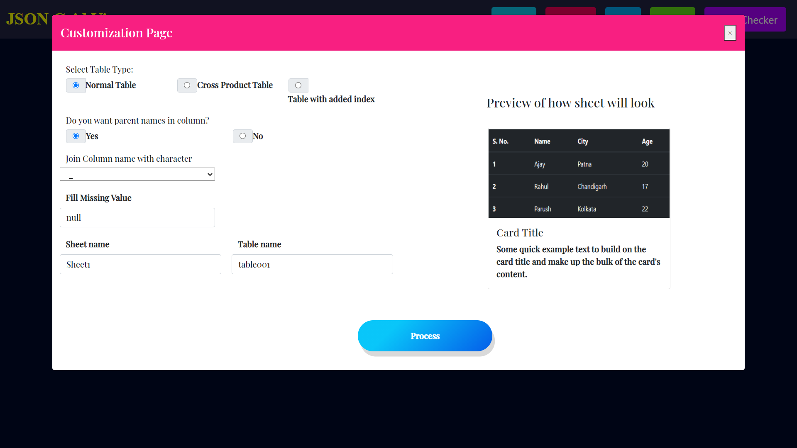

# Json-Grid-View

This project fetches the JSON in different ways and parses it into tabular form and saves it into HDFS.

### Steps to generate production application: [Link](docs/electronProduction.md)

	  
Requirements to run the project

	  > 1. node
	  > 2. python
	  > 3. java(Optional)
	  > 4. hadoop(Optional)

### Installation Steps: [Link](docs/installation.md)

	

	
How to Run

	**Run Backend**
	> 1. Open a new cmd window
	> 2. cd *path to Json-Grid-View folder*
	> 3. cd backend
	> 4. python App.py

	**Run Frontend**
	> 5. Open a new cmd window
	> 6. cd *path to Json-Grid-View folder*
	> 7. cd frontend
	> 8. npm install
	> 9. npm start

	Json-Grid-View should automatically open in your browser, if it doesn't enter http://localhost:3000/ in your browser!!!

# Features

### Excel Functionality

	
### Homepage

### Upload Json
**There are three different ways to parse the JSON**

	
- via URL
- via JSON in text box
- via JSON file upload
	

  
   
  

### Customize Table
**User can customize the table using the CustomizeTable Page**

### New Preview Page

<!-- ### Preview of the table generated 
- implemented paging for large files

  
   

 -->

<!-- ### Perform Queries using UI
- Select columns to load unique values of selected column
- Select from unique values (implemented paging)
- Enter text in SearchBox to perform a StartsWith search on selected column

  
   

**Click Query to generate preview after performing query**
	

  
   

 -->
	
### Perform Queries using SQL
- Enter Sql and click fetch

<!-- 

  
   

 -->

### Validate and Download corrected json
- Click 'Json Checker' in the nav-bar

### Download Options
- User can download 
	- Normal Data, data as it is
	- Preview Data, data generated after querying.
	
### Formats available
- Download Xlsx file
- Download Csv file
- Save to Hadoop and Download Sql Db file
	

<!-- 
	
### Example download : Download without query, download after query

  
   

 -->
	
### SQL table
	

	

<!--  -->
