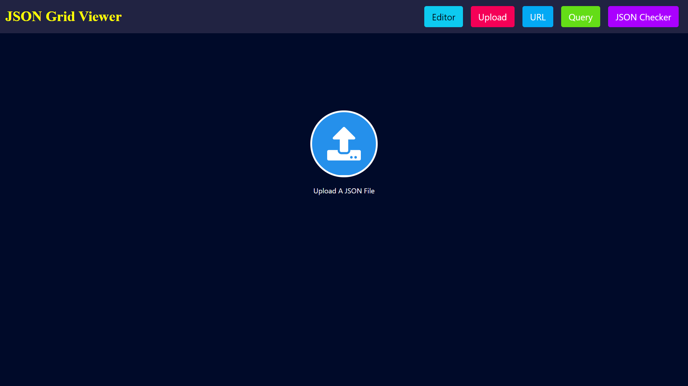

# Json-Grid-View

This project fetches the JSON in different ways and parses it into tabular form and saves it into HDFS.

	  
Requirements to run the project

	  > 1. node
	  > 2. python
	  > 3. java(Optional)
	  > 4. hadoop(Optional)

  	
Installation

	
  		Download Zip file and Extract it
	

	
Install Python Libraries

		 1. Open new cmd window

		 2. cd *path to extracted Json-Grid-View folder*

		 3. cd backend 

		 4. pip install -r requirements.txt

	

	
Install Node

	
	Step 1: Download Node.js Installer
	    	In a web browser, navigate to https://nodejs.org/en/download/ to download Node in your system.
	    	Click the Windows Installer button to download the latest default version. 
		The Node.js installer includes the NPM package manager.

		Congratulations !! You have succesfully downloaded the Node  in the machine.

	  Step 2: Install Node.js and NPM from Browser
	
		  1. Once the installer finishes downloading, launch it. 
		     Open the downloads link in your browser and click the file. Or, browse to the location 
		     where you have saved the file and double-click on it to launch.

		  2. A pop up will be generated which will ask if you want to run the software – click Run.

		  3. You will be welcomed to the Node.js Setup Wizard.
		     Now – click Next.

		  4. On the next screen, review the license agreement. 
		     Click Next for all and agree for all the the terms and install the software in the machine.

		  5. The installer will prompt you for the installation location. 
		     Leave the default location, unless you have a specific need to install it somewhere else – then click Next.
		     (In most cases the by default the installation location is in C drive. )

		  6. The wizard will let you select components to include or remove from the installation. 
		     Accepting the defaults is preferred.
		     Again, unless you have a specific need, accept the defaults by clicking Next.

		  7. Finally, click the Install button to run the installer. 
		     When it finishes, click Finish.

			Congratulations !! You have succesfully installed the Node and npm in the machine.

	Step 3: Verify Installation
	  Open a command prompt (or PowerShell), and enter the following:

		To check the version of Node.
		node -v
	
		If node was succesfully installed , the system should display the Node.js version installed on your system.
		If it is not the case try following the steps again. 

	
		To check the version of npm.
		npm -v
	
		If node was succesfully installed , the system should the system should display the npm version installed on your system.
		If it is not the case try following the steps again. 

	

	
	

	  
Install Hadoop

	

		
		

	

	
How to Run

	**Run Backend**
	> 1. Open a new cmd window
	> 2. cd *path to Json-Grid-View folder*
	> 3. cd backend
	> 4. python App.py

	**Run Frontend**
	> 5. Open a new cmd window
	> 6. cd *path to Json-Grid-View folder*
	> 7. cd frontend
	> 8. npm install
	> 9. npm start

	Json-Grid-View should automatically open in your browser, if it doesn't enter http://localhost:3000/ in your browser!!!

# Features

### Excel Functionality

	
### Homepage

### Upload Json
**There are three different ways to parse the JSON**

	
- via URL
- via JSON in text box
- via JSON file upload
	

  
   
  

### Customize Table
**User can customize the table using the CustomizeTable Page**

### New Preview Page

<!-- ### Preview of the table generated 
- implemented paging for large files

  
   

 -->

<!-- ### Perform Queries using UI
- Select columns to load unique values of selected column
- Select from unique values (implemented paging)
- Enter text in SearchBox to perform a StartsWith search on selected column

  
   

**Click Query to generate preview after performing query**
	

  
   

 -->
	
### Perform Queries using SQL
- Enter Sql and click fetch

<!-- 

  
   

 -->

### Validate and Download corrected json
- Click 'Json Checker' in the nav-bar

### Download Options
- User can download 
	- Normal Data, data as it is
	- Preview Data, data generated after querying.
	
### Formats available
- Download Xlsx file
- Download Csv file
- Save to Hadoop and Download Sql Db file
	

<!-- 
	
### Example download : Download without query, download after query

  
   

 -->
	
### SQL table
	

	

<!--  -->
